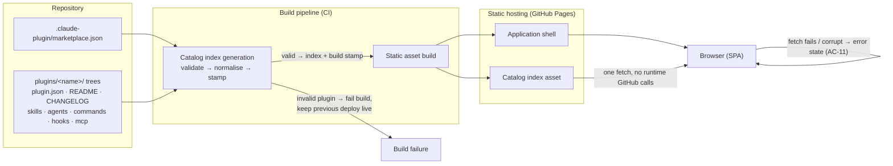
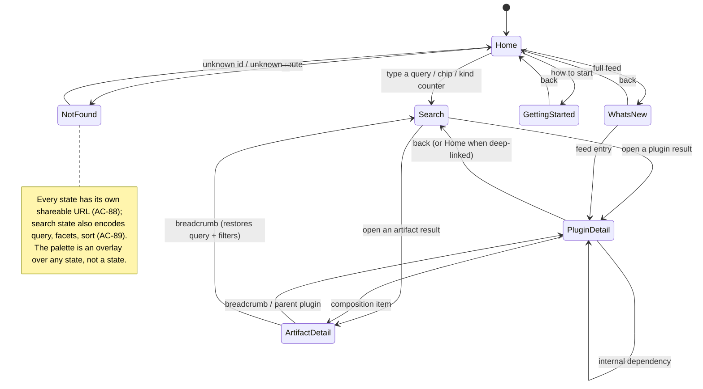

# Spec: AI Demo Marketplace catalog site — full MVP   |   Spec ID: SPEC-2026-07-25-catalog-site-mvp   |   Status: draft
Supersedes: none

## Problem & why

`ai-demo-marketplace` is a Claude Code plugin catalog: a manifest (`.claude-plugin/marketplace.json`) plus a
`plugins/<name>/` tree of skills, agents, commands, hooks and MCP servers. Today the only way to discover what
exists is to read the repository. The published site is a "Hello World" placeholder.

Workshop attendees need to *find* an artifact by describing what they want, understand what it does, and install it
with one copy-paste. Contributors need to see what changed and how to add their own plugin. A design mockup for the
whole catalog experience now exists (home, search, plugin detail, artifact detail, what's new, getting started,
command palette), so the MVP can be specified end to end in one pass.

Solving it now matters because the catalog is the workshop's shop window: if the artifacts are not discoverable, the
plugins in the repository are effectively invisible.

## Goals / Non-goals

**Goals**

- Goal: a fully static, deep-linkable catalog site covering all seven surfaces from the mockup, hosted on GitHub Pages.
- Goal: every artifact in the repository (plugin, skill, agent, command, hook, MCP server) is discoverable through
  client-side search, kind/keyword/author faceting and a keyboard command palette.
- Goal: one-click copy of the correct install command from every surface where an installable thing is shown.
- Goal: a single source of truth — the site's content is derived at build time from the repository itself, so the
  catalog can never drift from what is actually committed.
- Goal: keyboard-first, WCAG 2.1 AA operation; the site is usable without a mouse.
- Goal: the catalog degrades honestly — an empty catalog, a plugin without a README, or a plugin without a CHANGELOG
  each render a defined state rather than a blank area or a crash.

**Non-goals** (explicitly out of scope for this MVP)

- Non-goal: any backend, server runtime, API, or database. The deliverable is static assets only.
- Non-goal: authentication, user accounts, profiles, or personalisation stored server-side.
- Non-goal: ratings, reviews, comments, stars, download counters, or any social signal.
- Non-goal: plugin publishing, uploading, or editing from the UI. Contribution happens through the git repository.
- Non-goal: runtime calls to the GitHub API or any third-party service at page load.
- Non-goal: full-text search over the complete body of every markdown file in the repository. Search covers the
  indexed fields defined in *Contracts* (names, descriptions, keywords, and a bounded documentation excerpt),
  because that is what the design shows.
- Non-goal: server-side rendering, pre-rendering per route, or SEO-optimised static HTML per artifact.
- Non-goal: RSS/Atom generation. The mockup's "Subscribe · RSS" affordance links to the repository (see AC-70).
- Non-goal: versioned/historical catalog browsing (viewing an older release of a plugin).
- Non-goal: analytics, telemetry, A/B testing, or third-party tracking of any kind.

## User stories

**Workshop attendee (browsing / discovering)**

- S1: As a workshop attendee, I want to land on a home page that tells me what the catalog is and how many artifacts
  of each kind exist, so that I can grasp the catalog's size in a few seconds.
- S2: As a workshop attendee, I want to describe what I need in plain words in a search box, so that I find a
  relevant artifact without knowing its exact name.
- S3: As a workshop attendee, I want to browse by artifact kind (skill, agent, command, hook, MCP), so that I can
  explore without a query.
- S4: As a workshop attendee, I want to narrow results by keyword and author and re-sort them, so that I can shorten
  a long result list.
- S5: As a workshop attendee, I want to open an artifact and read its documentation, invocation and permitted tools,
  so that I can judge whether it does what I need before installing it.
- S6: As a keyboard-first user, I want a command palette on a shortcut, so that I can jump to any artifact without
  touching the mouse or the search page.
- S7: As a user with a light-mode preference or a colour preference, I want to switch theme and accent, so that the
  site is comfortable to read.

**Engineer (installing)**

- S8: As an engineer, I want the exact install command for a plugin shown verbatim and copyable in one click, so that
  I can paste it into Claude Code without re-typing.
- S9: As an engineer arriving at an artifact page, I want to know which plugin ships it and to copy that plugin's
  install command, so that I install the right thing.
- S10: As an engineer, I want a step-by-step "getting started" page with copyable commands for adding the marketplace
  and installing/updating plugins, so that I can onboard from zero.
- S11: As an engineer, I want to see a plugin's declared dependencies and jump to them, so that I understand what
  else gets pulled in.
- S12: As an engineer, I want to open the plugin's source on GitHub, so that I can inspect it before trusting it.

**Contributor (checking what changed)**

- S13: As a contributor, I want a reverse-chronological feed of releases across all plugins, so that I can see what
  changed recently without reading every CHANGELOG.
- S14: As a contributor, I want to see when the catalog index itself was built, so that I know whether my merged
  change is reflected.
- S15: As a contributor whose plugin is incomplete (no README, no CHANGELOG, no version), I want the site to still
  list it with an honest placeholder, so that a partial contribution is visible rather than invisible or broken.

**Everyone (sharing / navigating)**

- S16: As any user, I want every view to have its own URL that survives reload, sharing, and browser back/forward,
  so that I can send a colleague a link to a specific artifact or a specific filtered search.

## Acceptance criteria (EARS)

### A. Catalog index — build-time data generation

- AC-1: The catalog index **shall** be produced at build time from the repository's marketplace manifest and the
  `plugins/<name>/` trees, and the running site **shall** issue no network request to GitHub or any third-party
  service in order to render any view.
  _(observable: with the network blocked after first load, every view still renders; a build from a modified
  repository changes the site's content without any code change.)_
- AC-2: The index **shall** contain one plugin entity per plugin listed in the marketplace manifest, and one artifact
  entity per shipped skill, agent, command, hook and MCP server belonging to that plugin.
  _(observable: entity counts in the index equal the counts obtainable by walking the repository.)_
- AC-3: **IF** a plugin is listed in the manifest but its plugin manifest is missing or unparseable, **THEN** the
  build **shall** fail with a message naming the offending plugin, rather than emitting a partial index.
  _(observable: a deliberately corrupted plugin manifest makes the build exit non-zero and name the plugin.)_
- AC-4: **IF** a plugin has no README, no CHANGELOG, no declared keywords, no dependencies, or no artifacts of a given
  kind, **THEN** the build **shall** still emit that plugin's entity with the corresponding fields absent, and
  **shall not** fail.
  _(observable: removing a plugin's README leaves the build green and the plugin present in the index.)_
- AC-5: **IF** two plugins or two artifacts within one plugin would resolve to the same identifier, **THEN** the build
  **shall** fail and name both colliding sources.
  _(observable: a duplicated plugin name in the manifest makes the build exit non-zero naming both entries.)_
- AC-6: The index **shall** carry a build timestamp and the source commit reference, and the site **shall** display
  the build timestamp in a persistent location reachable from every view.
  _(observable: the visible stamp changes between two builds of different commits.)_
- AC-7: **WHERE** a plugin declares dependencies, the index **shall** record each dependency's name and requested
  version range, and **shall** mark whether that dependency resolves to another plugin in this same catalog.
  _(observable: the dependency on a catalog-internal plugin is flagged resolvable; a dependency on an unknown name is
  flagged unresolvable.)_
- AC-8: The index **shall** record, for every plugin and every artifact, a canonical install command string and a
  canonical source URL pointing at that entity's location in the repository.
  _(observable: every entity in the index has a non-empty install command and source URL.)_
- AC-9: **IF** a plugin declares no version, **THEN** the index **shall** omit the version field and every surface
  that shows a version **shall** render a neutral placeholder instead of an empty badge.
  _(observable: a plugin with no version shows a visible placeholder, not an empty coloured pill.)_
- AC-10: The index **shall** store, per artifact, a bounded documentation excerpt for search and for the artifact
  detail body, and the total transferred index payload **shall not** exceed 512 KB compressed.
  _(observable: measured transfer size of the index asset in a production build is under the budget.)_
- AC-11: **IF** the index asset fails to load or is unparseable at runtime, **THEN** the site **shall** render an
  error state naming the failure and offering a retry and a link to the repository, and **shall not** render an empty
  catalog as though the catalog were genuinely empty.
  _(observable: serving a truncated index shows the error state, distinct from the empty-catalog state.)_
- AC-12: **WHILE** the index has not yet been parsed, every data-driven surface **shall** display a loading state
  that reserves the final layout's space.
  _(observable: with the index request artificially delayed, the page shows placeholders and does not shift layout by
  more than 0.1 CLS when data arrives.)_

### B. Application shell and header

- AC-13: The header **shall** be present on every view, remain fixed to the top of the viewport while the page
  scrolls, and expose the catalog brand, the global search input, a command-palette trigger, a theme toggle, and a
  link to the repository.
  _(observable: scrolling any view keeps all five controls reachable.)_
- AC-14: **WHEN** the user activates the brand element by click or by keyboard, the system **shall** navigate to the
  home view and move focus to the top of the page.
  _(observable: activating the brand from a detail view lands on home with focus at the start of the document.)_
- AC-15: **WHEN** the user types into the header search input, the system **shall** navigate to the search view (if
  not already there), preserve the typed text, and update results no later than 250 ms after the last keystroke.
  _(observable: typing from home switches to search; results update once per typing pause, not once per keystroke.)_
- AC-16: **WHEN** the user presses Enter in the header search input, the system **shall** commit the current query to
  the search view immediately without waiting for the debounce interval.
  _(observable: typing then pressing Enter shows results with no additional delay.)_
- AC-17: **WHEN** the search input contains text, the system **shall** offer a clear control that, on activation,
  empties the query, restores the unfiltered result set, and returns focus to the input.
  _(observable: the clear control appears only with text present; after use, the input is empty and focused.)_
- AC-18: **WHEN** the user activates the theme toggle, the system **shall** switch between dark and light appearance,
  persist the choice on the device, and apply it on the next visit before first paint.
  _(observable: after toggling and reloading, the chosen theme is applied with no flash of the other theme.)_
- AC-19: **WHERE** the user has expressed no explicit theme choice, the system **shall** follow the operating system
  colour-scheme preference and **shall** follow subsequent changes to it.
  _(observable: switching the OS to light mode on a first visit renders the light appearance.)_
- AC-20: **WHEN** the user selects an accent from the accent switcher, the system **shall** apply that accent across
  all views, persist it on the device, and keep every text/background pair at or above the contrast thresholds in
  AC-96.
  _(observable: each of the offered accents passes contrast checks in both themes.)_
- AC-21: The theme toggle, accent switcher, and command-palette trigger **shall** each expose an accessible name and
  their current state, and **shall not** rely on an icon glyph alone.
  _(observable: a screen reader announces e.g. "switch to light theme" and the accent's current value.)_
- AC-22: **WHEN** the user activates the repository link, the system **shall** open it in a new browsing context
  isolated from the site, and the link **shall** be announced as opening in a new tab.
  _(observable: the link opens a new tab, the new tab has no reference back to the opener, and its accessible name
  states that it opens externally.)_

### C. Home view

- AC-23: **WHEN** the home view is displayed with a non-empty catalog, the system **shall** show the hero heading and
  description, the hero search input, keyword shortcut chips, per-kind counters, the recent-releases preview, and the
  browse-by-kind list.
  _(observable: all six sections are present on a home render against the real catalog.)_
- AC-24: **WHEN** the user types into the hero search input, the system **shall** behave identically to the header
  search input as defined in AC-15 through AC-17.
  _(observable: hero and header inputs produce the same navigation, debounce and clear behaviour.)_
- AC-25: **WHEN** the user activates a keyword shortcut chip, the system **shall** navigate to the search view with
  that keyword applied as the only active filter and the text query empty.
  _(observable: the resulting URL and the search view show exactly one active keyword facet.)_
- AC-26: The keyword shortcut chips **shall** be derived from the catalog's most frequent keywords, capped at seven,
  and **WHERE** the catalog declares no keywords the chip row **shall** be omitted entirely.
  _(observable: with keywords stripped from every plugin, no chip row renders and no empty gap remains.)_
- AC-27: **WHEN** the user activates a per-kind counter or a browse-by-kind item, the system **shall** navigate to the
  search view pre-filtered to that kind with an empty text query.
  _(observable: activating the "agents" counter lands on a search URL filtered to agents.)_
- AC-28: Each per-kind counter and browse-by-kind item **shall** display the exact number of catalog entities of that
  kind, and **WHERE** the count is zero the item **shall** remain visible, show zero, and be non-activatable.
  _(observable: a kind with no artifacts renders as a disabled item showing 0, announced as unavailable.)_
- AC-29: **WHEN** the home view is displayed and the catalog contains zero plugins, the system **shall** replace the
  statistics, releases and browse sections with an empty-catalog state offering a route to the getting-started view
  and a link to the contribution guidelines, while keeping the hero and search visible.
  _(observable: building from a manifest with an empty plugin list renders the empty state and no zeroed sections.)_
- AC-30: The home recent-releases preview **shall** show at most the four most recent release entries across all
  plugins, ordered newest first, and **WHEN** the user activates an entry the system **shall** navigate to that
  plugin's detail view.
  _(observable: the preview never exceeds four rows and its order matches the full feed's first four.)_
- AC-31: **WHEN** the user activates the "full feed" link next to the releases preview, the system **shall** navigate
  to the what's-new view.
  _(observable: the link lands on the what's-new URL.)_
- AC-32: **WHERE** no plugin in the catalog has any changelog entry, the home releases section **shall** be omitted
  rather than rendered empty.
  _(observable: with all CHANGELOGs removed, the home page shows no releases heading.)_

### D. Search view

- AC-33: **WHEN** the search view is displayed, the system **shall** show a heading reflecting the current query (or a
  neutral browse heading when the query is empty), the number of matching entities, the sort control, the facet
  sidebar, and the result grid.
  _(observable: all five regions render; the count matches the number of cards.)_
- AC-34: **WHEN** a text query is present, the system **shall** rank matches so that a match on an entity's name or
  display name outranks a match on its keywords, which outranks a match on its description, which outranks a match on
  its documentation excerpt, and **shall** exclude any entity that does not match every whitespace-separated token of
  the query somewhere.
  _(observable: querying two tokens returns only entities matching both; a name match sorts above a body-only match.)_
- AC-35: **WHEN** the user changes the sort control between relevance, name and recently-updated, the system **shall**
  reorder the current result set accordingly without changing which entities are included.
  _(observable: the result count is identical across all three sort options for the same query and facets.)_
- AC-36: **WHERE** the text query is empty, the relevance sort option **shall** be disabled or fall back to name
  order, so that the ordering is never arbitrary.
  _(observable: with no query, results are in a deterministic, documented order across reloads.)_
- AC-37: **WHEN** the user activates a kind facet, the system **shall** toggle that kind's membership in the active
  kind filter, apply the filter to the results, and reflect the toggle's pressed state to assistive technology.
  _(observable: activating two kinds shows the union of both kinds; each facet exposes a pressed state.)_
- AC-38: **WHEN** the user activates a keyword facet, the system **shall** toggle that keyword, and results **shall**
  include entities carrying any of the active keywords.
  _(observable: two active keywords widen rather than narrow the result set.)_
- AC-39: **WHEN** the user activates an author facet, the system **shall** apply that author as the single active
  author filter, and activating the same author again **shall** clear it.
  _(observable: only one author can be active at a time; re-activating clears it.)_
- AC-40: Each facet **shall** display the number of catalog entities it would match, and **WHERE** a facet would match
  zero entities under the current text query the facet **shall** be shown as unavailable rather than hidden.
  _(observable: an impossible facet is visibly and programmatically disabled, not removed, so the sidebar does not
  reflow while typing.)_
- AC-41: **WHEN** the user activates the reset control, the system **shall** clear all kind, keyword and author
  filters and the text query in one action, and return the view to the unfiltered browse state.
  _(observable: one activation empties every facet and the query; the URL loses all filter parameters.)_
- AC-42: **WHILE** at least one filter or a text query is active, the system **shall** indicate the number of active
  filters, and **WHILE** nothing is active the reset control **shall** be disabled.
  _(observable: the reset control is inert on a clean search view.)_
- AC-43: **WHEN** the current query and filters yield no matches, the system **shall** display a zero-results state
  explaining that nothing matched and offering to reset the filters, and **shall not** render an empty grid.
  _(observable: a nonsense query renders the zero-results state with a working reset action.)_
- AC-44: Each result card **shall** display the entity's kind, version (or the AC-9 placeholder), display name,
  description, up to three keywords, an owning-plugin/author meta line, a copy-install control and an open control.
  _(observable: every card exposes exactly these elements for every kind.)_
- AC-45: **WHEN** the user activates a result card's open control, its title, or the card itself by click, Enter or
  Space, the system **shall** navigate to that entity's detail view.
  _(observable: keyboard activation of a card reaches the same view as a mouse click.)_
- AC-46: Each result card **shall** be reachable by a single Tab stop for its primary open action plus one for its
  copy action, so that traversing N cards never costs more than 2N Tab presses.
  _(observable: tabbing through a six-card grid takes twelve stops.)_
- AC-47: **WHEN** a pointer hovers or keyboard focus enters a result card, the system **shall** apply a visible
  emphasis to the card, and the focus indicator **shall** satisfy AC-97.
  _(observable: hover and focus produce a perceptible, non-colour-only change.)_
- AC-48: **IF** an entity's display name or description exceeds the card's space, **THEN** the system **shall** clamp
  the visible text (name to one line, description to two) without altering the layout of neighbouring cards, and the
  full text **shall** remain available on the entity's detail view.
  _(observable: an artificially long name or description leaves the grid geometry unchanged.)_
- AC-49: The kind badge **shall** convey the kind through its text label in addition to its colour, so that colour is
  never the sole carrier of meaning.
  _(observable: rendered in greyscale, every card's kind remains identifiable.)_

### E. Plugin detail view

- AC-50: **WHEN** a plugin detail view is displayed, the system **shall** show the plugin's display name, version
  badge, compatibility badge, description, author, last-updated stamp, install command, copy control, source link,
  the grouped list of its artifacts, its dependencies, its README and its changelog.
  _(observable: all listed regions render for a fully populated plugin.)_
- AC-51: **WHEN** the user activates the back control, the system **shall** return to the previously visited catalog
  view if the user arrived from within the site, and to the home view otherwise.
  _(observable: arriving by deep link and pressing back reaches home rather than a blank history entry.)_
- AC-52: The plugin's artifacts **shall** be grouped by kind in a stable order, each group labelled with its kind and
  item count, and **WHERE** a plugin ships no artifacts of a kind, that group **shall** be omitted.
  _(observable: a plugin with only skills shows exactly one group.)_
- AC-53: **WHEN** the user activates an artifact item within the composition list, the system **shall** navigate to
  that artifact's detail view.
  _(observable: activating an item lands on the artifact URL with a matching breadcrumb.)_
- AC-54: **WHERE** a plugin declares at least one dependency, the system **shall** render the dependency list showing
  each dependency's name and requested range; **WHERE** there are none, the section **shall** be omitted.
  _(observable: a plugin without dependencies shows no dependency heading.)_
- AC-55: **WHEN** the user activates a dependency that resolves to another plugin in this catalog, the system
  **shall** navigate to that plugin's detail view; **IF** the dependency does not resolve within the catalog,
  **THEN** it **shall** be rendered as non-navigable and visibly marked as external.
  _(observable: an unresolvable dependency is not a link and is labelled as external.)_
- AC-56: **WHERE** a plugin has a README, the system **shall** render its markdown as formatted content subject to
  AC-111; **WHERE** it has none, the section **shall** show a placeholder inviting a contribution and linking to the
  contribution guidelines.
  _(observable: removing a README swaps the rendered body for the placeholder, with no layout break.)_
- AC-57: **WHERE** a plugin has changelog entries, the system **shall** list them newest first, each showing its
  version, its date and its summary; **WHERE** it has none, the section **shall** show a placeholder.
  _(observable: entries are ordered newest first and a plugin without a CHANGELOG shows the placeholder.)_
- AC-58: **IF** a changelog entry carries no parseable date, **THEN** the system **shall** render the entry without a
  date, place it after all dated entries of the same plugin, and **shall not** render an invalid date string.
  _(observable: an undated entry shows no date cell and never reads "Invalid Date" or "NaN".)_
- AC-59: **IF** a plugin has no derivable last-updated date, **THEN** the system **shall** omit the updated stamp
  rather than showing an empty or placeholder date, and the recently-updated sort **shall** place that plugin last.
  _(observable: an undated plugin sorts to the end under recently-updated and shows no stamp.)_
- AC-60: **WHERE** a plugin declares no compatibility statement, the compatibility badge **shall** be omitted rather
  than rendered empty.
  _(observable: the current catalog's plugins, which declare none, render no empty badge.)_
- AC-61: **WHEN** the user activates the source link on a plugin detail view, the system **shall** open that plugin's
  directory in the repository in an isolated new browsing context, per AC-22.
  _(observable: the opened URL points at the plugin's directory on the default branch.)_

### F. Artifact detail view

- AC-62: **WHEN** an artifact detail view is displayed, the system **shall** show a breadcrumb of catalog → owning
  plugin → artifact, the kind badge, the display name, the description, the install command with a copy control, and
  the artifact's documentation body.
  _(observable: all regions render for every artifact kind.)_
- AC-63: **WHEN** the user activates the catalog breadcrumb segment, the system **shall** navigate to the search view
  restoring the last query and filters used in this session, or to the unfiltered browse state if none were used; and
  **WHEN** the user activates the plugin segment, the system **shall** navigate to that plugin's detail view.
  _(observable: returning from an artifact reached via a filtered search restores those filters.)_
- AC-64: **WHERE** an artifact declares an invocation token (a slash command or an agent handle), the system **shall**
  display it verbatim in a monospaced, copyable form; **WHERE** it declares none, the invocation element **shall** be
  omitted.
  _(observable: a hook, which has no invocation, renders no empty invocation pill.)_
- AC-65: **WHERE** an artifact declares tools or permissions, the system **shall** list them as discrete labelled
  items; **WHERE** it declares none, the section **shall** be omitted.
  _(observable: an artifact with no declared tools shows no "tools/permissions" heading.)_
- AC-66: The install command shown on an artifact detail view **shall** be the install command of its owning plugin,
  and the view **shall** state explicitly that installing the plugin is what makes this artifact available.
  _(observable: the copied text on an artifact page equals the copied text on its plugin page, and the explanatory
  text is present.)_
- AC-67: **WHERE** an artifact has no documentation body, the system **shall** show a placeholder in the
  documentation section and a link to the artifact's source in the repository.
  _(observable: an artifact whose source file contains only frontmatter shows the placeholder plus source link.)_

### G. What's New view

- AC-68: **WHEN** the what's-new view is displayed, the system **shall** list every changelog entry from every plugin
  in the catalog, newest first, each showing its plugin's display name, its version, its date and its summary.
  _(observable: the entry count equals the sum of all plugins' changelog entries.)_
- AC-69: **WHEN** the user activates a feed entry by click, Enter or Space, the system **shall** navigate to that
  entry's plugin detail view.
  _(observable: keyboard activation of a feed row reaches the plugin view.)_
- AC-70: **WHEN** the user activates the subscribe affordance, the system **shall** open the repository's releases or
  watch page in an isolated new browsing context, and the affordance's accessible name **shall** state that it leads
  to the repository rather than to a feed file.
  _(observable: no request is made for a feed file; the name does not promise an RSS document.)_
- AC-71: **WHERE** the catalog has no changelog entries at all, the what's-new view **shall** render an empty state
  explaining that no releases have been recorded yet, with a route to the getting-started view.
  _(observable: with all CHANGELOGs removed, the view shows the empty state rather than a blank page.)_
- AC-72: **WHEN** the user activates the back-to-home control, the system **shall** navigate to the home view.
  _(observable: the control reaches the home URL.)_

### H. Getting Started view

- AC-73: **WHEN** the getting-started view is displayed, the system **shall** show an ordered sequence of numbered
  steps, each with a title, an explanation, a literal shell/slash command and a per-step copy control, plus the
  explanatory note distinguishing updating the marketplace source from updating an installed plugin.
  _(observable: every step exposes a number, a title, a command and its own copy control.)_
- AC-74: The commands shown **shall** be generated from the catalog's own identity — the marketplace's registered
  name and a real plugin name from the index — so that they remain correct if the marketplace or a plugin is renamed.
  _(observable: renaming the marketplace in the manifest changes the displayed commands after a rebuild.)_
- AC-75: **WHEN** the user activates a step's copy control, the system **shall** copy that step's command only, per
  the copy behaviour in AC-76 through AC-78.
  _(observable: copying step 2 places only step 2's command on the clipboard.)_

### I. Copy-to-clipboard and toast

- AC-76: **WHEN** the user activates any copy control, the system **shall** place the exact displayed command text on
  the clipboard, change that control's label to a success label for approximately 2 seconds, then restore the
  original label.
  _(observable: the pasted text matches the displayed text character for character; the label reverts.)_
- AC-77: **WHEN** a copy succeeds, the system **shall** show a transient confirmation notification that disappears
  automatically, and **shall** announce the success to assistive technology through a polite live region without
  moving focus.
  _(observable: a screen reader announces the confirmation; keyboard focus stays on the copy control.)_
- AC-78: **IF** writing to the clipboard fails or is not permitted, **THEN** the system **shall** show a failure
  message and leave the command text selectable so the user can copy it manually, and **shall not** show the success
  label.
  _(observable: with clipboard permission denied, the failure message appears and the command text can be selected.)_
- AC-79: At most one copy control **shall** display the success state at a time, and starting a new copy **shall**
  immediately reset any previously succeeded control.
  _(observable: copying card A then card B leaves only B in the success state.)_

### J. Command palette

- AC-80: **WHEN** the user presses the palette shortcut (the platform's command/control key together with K), the
  system **shall** open the palette with an empty query and focus its input, and **shall** prevent the browser's
  default handling of that shortcut.
  _(observable: the shortcut opens the palette from every view and the browser's own action does not fire.)_
- AC-81: **WHEN** the user activates the header palette trigger, the system **shall** open the palette in the same
  state as AC-80.
  _(observable: trigger and shortcut produce an identical palette state.)_
- AC-82: **WHILE** the palette is open, the system **shall** trap keyboard focus within it, mark the rest of the page
  as inert to assistive technology, and **shall not** allow the page behind it to scroll.
  _(observable: Tab cycles only within the palette; the background does not scroll.)_
- AC-83: **WHILE** the palette is open and the query is empty, the system **shall** list catalog entities capped at
  eight, and **WHEN** the user types, the system **shall** re-rank the list using the same matching rules as AC-34,
  ignoring the search view's active facets.
  _(observable: the palette returns results that the currently filtered search view would exclude.)_
- AC-84: **WHEN** the user presses Down or Up in the palette, the system **shall** move the active selection by one
  item with wrap-around and keep the active item scrolled into view; **WHEN** the user presses Enter, the system
  **shall** navigate to the active item's detail view and close the palette.
  _(observable: arrow keys move a visible active highlight; Enter navigates.)_
- AC-85: **WHEN** the user presses Escape, activates the backdrop, or presses the palette shortcut again, the system
  **shall** close the palette and return focus to the element that had focus before it opened.
  _(observable: after closing, focus is back on the palette trigger or the previously focused control.)_
- AC-86: **WHEN** the palette query matches no entity, the system **shall** display a no-results message inside the
  palette and Enter **shall** perform no navigation.
  _(observable: a nonsense palette query shows the message and Enter is inert.)_
- AC-87: **WHILE** the catalog is empty or the index failed to load, the palette **shall** open and state that there
  is nothing to search rather than showing an empty list.
  _(observable: with an empty catalog the palette shows an explanatory message.)_

### K. Routing, deep links and history

- AC-88: Every view — home, search, plugin detail, artifact detail, what's new, getting started — **shall** have a
  distinct, shareable URL that reproduces the same view on a cold load.
  _(observable: copying the URL of each view into a fresh browser session renders the same view.)_
- AC-89: The search view's URL **shall** encode the text query, the active kind, keyword and author filters, and the
  sort order, and a cold load of that URL **shall** reproduce the identical result set and ordering.
  _(observable: a shared filtered-search URL renders the same cards in the same order for another user.)_
- AC-90: **WHEN** the user changes the query or a filter on the search view, the system **shall** replace rather than
  push the history entry for rapid successive changes, so that a single Back press leaves the search view rather than
  stepping through every intermediate query.
  _(observable: typing a ten-character query then pressing Back once leaves the search view.)_
- AC-91: **WHEN** the user presses browser Back or Forward, the system **shall** restore the corresponding view
  together with its query, filters, sort and scroll position.
  _(observable: navigating search → detail → Back returns to the same scroll offset and the same results.)_
- AC-92: **IF** a URL references an unknown plugin identifier, an unknown artifact identifier, or an unknown view,
  **THEN** the system **shall** render a not-found state naming what was not found and offering routes to home and to
  search, and **shall not** render a blank page or a runtime error.
  _(observable: a deep link to a deleted plugin shows the not-found state.)_
- AC-93: The routing scheme **shall** function on static hosting that cannot rewrite unknown paths to the application
  shell, for arbitrary deep links, without a server-side rule.
  _(observable: a deep link to an artifact, loaded cold from the deployed GitHub Pages site, renders that artifact
  rather than the host's 404 page.)_
- AC-94: All internal navigation **shall** occur without a full document reload, and **shall** move keyboard focus to
  the newly rendered view's main heading and announce the view change to assistive technology.
  _(observable: after navigating, the next Tab press continues from the new view's start and a screen reader
  announces the new page title.)_
- AC-95: **WHEN** any view is rendered, the system **shall** set a document title that identifies the specific view
  and entity, distinct from every other view's title.
  _(observable: browser history entries are individually distinguishable by title.)_

## Story → criteria traceability

| Story | Covered by |
|---|---|
| S1 — grasp the catalog at a glance | AC-23, AC-27, AC-28, AC-29, AC-32 |
| S2 — describe what I need and find it | AC-15, AC-16, AC-17, AC-24, AC-33, AC-34, AC-43 |
| S3 — browse by kind | AC-27, AC-28, AC-37, AC-40 |
| S4 — narrow and re-sort | AC-25, AC-26, AC-35, AC-36, AC-38, AC-39, AC-41, AC-42 |
| S5 — read an artifact before installing | AC-44, AC-45, AC-53, AC-62, AC-64, AC-65, AC-67 |
| S6 — keyboard command palette | AC-80 – AC-87, AC-97 |
| S7 — theme and accent | AC-18, AC-19, AC-20, AC-21, AC-96 |
| S8 — copy a plugin's install command | AC-8, AC-50, AC-76, AC-77, AC-78, AC-79 |
| S9 — know the owning plugin, copy its command | AC-62, AC-63, AC-66 |
| S10 — getting started from zero | AC-73, AC-74, AC-75 |
| S11 — see and follow dependencies | AC-7, AC-54, AC-55 |
| S12 — open the source on GitHub | AC-22, AC-61, AC-67 |
| S13 — reverse-chronological release feed | AC-30, AC-31, AC-57, AC-68, AC-69, AC-71 |
| S14 — know when the index was built | AC-6, AC-110 |
| S15 — incomplete plugin still listed honestly | AC-4, AC-9, AC-56, AC-57, AC-58, AC-59, AC-60 |
| S16 — deep-linkable, history-correct URLs | AC-88 – AC-95 |

## Edge cases

| Case | Expected behaviour | Coverage |
|---|---|---|
| Catalog contains zero plugins | Home shows a dedicated empty-catalog state; search, what's-new and palette show their own empty states | AC-29, AC-71, AC-87 |
| Query and filters match nothing | Zero-results state with a working reset | AC-43 |
| Very long display name | Clamped to one line on cards; full text on the detail view | AC-48 |
| Very long description | Clamped to two lines on cards; full text on the detail view | AC-48 |
| Plugin with no README | README section shows a contribution placeholder; build stays green | AC-4, AC-56 |
| Plugin with no CHANGELOG | Changelog section shows a placeholder; plugin absent from the release feed | AC-4, AC-57 |
| Plugin with dependencies | Dependency section listed and navigable when internal | AC-7, AC-54, AC-55 |
| Plugin without dependencies | Dependency section omitted | AC-54 |
| Dependency pointing outside the catalog | Rendered non-navigable and marked external | AC-55 |
| Missing version | Neutral placeholder instead of an empty badge | AC-9 |
| Missing or unparseable date | Entry rendered dateless, sorted after dated entries; never "Invalid Date" | AC-58, AC-59 |
| Missing compatibility statement | Badge omitted | AC-60 |
| Duplicate plugin or artifact identifier | Build fails naming both sources | AC-5 |
| Malformed / unparseable plugin manifest | Build fails naming the plugin | AC-3 |
| Deep link to unknown plugin or artifact | Not-found state with routes out | AC-92 |
| Deep link to an arbitrary path on static hosting | Resolves to the application, not the host's 404 | AC-93 |
| Browser back / forward across views | View, filters, sort and scroll restored | AC-91 |
| Rapid typing then a single Back press | Leaves the search view rather than replaying keystrokes | AC-90 |
| First paint before data hydration | Layout-reserving loading state, CLS budget respected | AC-12, AC-102 |
| Index asset fails to load or is corrupt | Explicit error state with retry, distinct from empty catalog | AC-11 |
| `prefers-reduced-motion` enabled | All non-essential motion suppressed | AC-98 |
| Narrow viewport (≥320 px) | Single-column layout; facets in a collapsible disclosure; no horizontal scroll | AC-101 |
| JavaScript disabled or the main bundle fails | A static no-script message with a link to the repository | AC-105 |
| Clipboard write denied | Failure message; text remains manually selectable | AC-78 |
| Artifact with no invocation (e.g. a hook) | Invocation element omitted | AC-64 |
| Artifact with no declared tools | Tools section omitted | AC-65 |
| Artifact with an empty documentation body | Placeholder plus source link | AC-67 |
| A kind with zero artifacts in the whole catalog | Counter visible showing 0, non-activatable; facet shown unavailable | AC-28, AC-40 |
| Two browser tabs with different theme choices | Last write wins per device; no cross-tab synchronisation | accepted: no handling |
| A README containing an image or an iframe | Images allowed from the repository origin; embedded frames stripped | AC-111, AC-113 |
| Search across a catalog an order of magnitude larger than today | Interaction budget in AC-104 still applies up to 2 000 entities | AC-104 |
| A plugin renamed between builds, breaking an old shared link | Not-found state; no redirect map maintained | AC-92, accepted: no redirects |

## Non-functional

**Accessibility (WCAG 2.1 AA)**

- AC-96: All text and meaningful non-text content **shall** meet a contrast ratio of at least 4.5:1 for normal text,
  3:1 for large text and UI component boundaries, in both themes and for every accent.
  _(observable: an automated contrast audit reports zero violations across the theme × accent matrix.)_
- AC-97: Every interactive element **shall** be reachable and operable by keyboard alone, in a logical order, and
  **shall** display a focus indicator with at least a 3:1 contrast ratio against its adjacent background.
  _(observable: the full site can be exercised without a pointer; no control has a suppressed focus ring.)_
- AC-98: **WHERE** the user has requested reduced motion, the system **shall** suppress all transitions, entrance
  animations and backdrop blurs, retaining only instantaneous state changes.
  _(observable: with the preference set, opening the palette and the toast produce no animation.)_
- AC-99: Every icon-only control **shall** carry an accessible name, and every dynamic region (results count, toast,
  copy state) **shall** announce its change through an appropriate live region.
  _(observable: a screen-reader pass names every control and hears the result count update.)_
- AC-100: Kind, state and status **shall** never be conveyed by colour alone; each **shall** also carry a text label
  or a shape.
  _(observable: a greyscale render preserves every distinction.)_

**Responsive**

- AC-101: **WHEN** the viewport width is at least 320 CSS pixels, the system **shall** render every view in a
  single-column layout with the search facets in a collapsible disclosure and **shall not** produce horizontal
  scrolling.
  _(observable: at 320 px wide, no horizontal scrollbar appears on any view.)_

**Performance**

- AC-102: On a cold load over a simulated 4G connection on a mid-tier mobile device, the home view's Largest
  Contentful Paint **shall** be at most 2.5 s and its Cumulative Layout Shift at most 0.1.
  _(observable: a Lighthouse mobile run against the deployed site meets both thresholds.)_
- AC-103: The initial JavaScript payload required to render the home view **shall not** exceed 180 KB compressed,
  excluding the catalog index.
  _(observable: a production bundle report keeps the entry chunk under the budget.)_
- AC-104: **WHEN** the user types a search query or toggles a facet over a catalog of up to 2 000 entities, the
  system **shall** present updated results within 100 ms of the debounce firing, on a mid-tier device.
  _(observable: an interaction trace over a synthetic 2 000-entity index stays under the budget.)_

**Degradation**

- AC-105: **IF** JavaScript is disabled or the application bundle fails to execute, **THEN** the served document
  **shall** display a readable message explaining that the catalog requires JavaScript and linking to the repository.
  _(observable: with scripting disabled, the page shows the message, not a blank body.)_

**Privacy**

- AC-106: The site **shall** load no analytics, tracking, advertising or third-party measurement resource, and
  **shall** transmit no user data anywhere; persisted state (theme, accent) **shall** remain on the user's device.
  _(observable: a network trace of a full session shows requests only to the site's own origin and, where fonts are
  used, a self-hosted font asset.)_

**Language and internationalisation readiness**

- AC-116: Every user-facing string the site renders — headings, labels, button text, placeholders, empty/error/
  loading states, toasts, accessible names and the document title — **shall** be in English, and the document
  **shall** declare English as its content language. The Ukrainian copy in the design mockup **shall** be treated as
  a translation reference for wording and tone only, never as shipped text. Contributor-authored content (README,
  CHANGELOG, descriptions) is exempt: it renders in whatever language its author wrote it.
  _(observable: a sweep of every view in every state — including empty, zero-result, not-found, error and toast
  states — finds no non-English site copy; the rendered document declares an English content language.)_
- AC-107: All user-facing copy **shall** be resolved through a single centralised message catalogue keyed by
  identifier, with no user-facing string embedded in behavioural logic, and **shall not** be assembled by
  concatenating fragments around a value. This requirement holds even though English is the only locale shipped in
  the MVP (AC-116), so that a second locale can be added later by supplying a catalogue alone, with no change to
  behaviour, layout or logic.
  _(observable: replacing the message catalogue wholesale changes every visible string with no other change; a
  pluralised count such as the result label is produced by a single parameterised message; no user-facing literal
  appears outside the catalogue.)_
- AC-108: Dates and counts **shall** be formatted through locale-aware formatting rather than hard-coded patterns.
  _(observable: switching the active locale changes date rendering without a code change.)_

**Testability**

- AC-109: Every interactive element **shall** be locatable by its accessible role and name, so that behavioural tests
  need no implementation-specific test identifiers; a test identifier **shall** be used only where no accessible name
  can express the element.
  _(observable: the acceptance test suite queries by role and name throughout.)_

**Content freshness**

- AC-110: The deployed site **shall** be rebuilt and republished whenever the catalog manifest or any file under a
  plugin directory changes on the default branch, and the visible build stamp **shall** reflect the newest such
  change.
  _(observable: merging a plugin change and waiting for the deployment updates the visible build stamp.)_

## Cross-module interactions

The system spans three participants: the **repository content** (manifest + plugin trees), the **build pipeline**
(CI, which generates the catalog index and publishes static assets), and the **site** (a static client application
served by GitHub Pages).

Failure contract:

- Repository → build: a structurally invalid plugin (unparseable manifest, duplicate identifier) fails the build; the
  previously deployed site remains live and unchanged (AC-3, AC-5).
- Repository → build: an incomplete but valid plugin (no README, no CHANGELOG, no version) never fails the build; the
  gap is carried into the index as an absent field and surfaced as a placeholder (AC-4, AC-9, AC-56, AC-57).
- Build → site: the index is the only data contract. The site performs no other data acquisition at runtime (AC-1).
- Site → index asset: a failed or corrupt fetch is an explicit, distinguishable error state, never an empty catalog
  (AC-11).

Navigation and routing model:

## Contracts

Shapes only — field names below are conceptual, not a serialisation format.

**Catalog index (root)**

| Field | Direction | Optional | Notes |
|---|---|---|---|
| marketplace name | build → site | required | the registered marketplace identifier used to compose install commands |
| marketplace description | build → site | optional | shown in the hero when present |
| repository URL | build → site | required | base for all source and contribution links |
| build timestamp | build → site | required | ISO instant; drives the visible freshness stamp (AC-6) |
| source commit reference | build → site | required | identifies the exact repository state indexed |
| plugins | build → site | required | list of *Plugin*; may be empty (empty-catalog state) |

**Plugin**

| Field | Direction | Optional | Notes |
|---|---|---|---|
| id | build → site | required | stable, unique across the catalog; used in URLs |
| name | build → site | required | kebab-case package name |
| display name | build → site | required | falls back to a humanised `name` when not declared |
| description | build → site | required | may be empty string only if absent upstream |
| version | build → site | optional | absent → AC-9 placeholder |
| author name | build → site | optional | drives the author facet; entities without one are grouped as unattributed |
| keywords | build → site | optional | list of strings; absent → no chips, no keyword facets for this plugin |
| category | build → site | optional | from the marketplace manifest |
| compatibility | build → site | optional | absent → badge omitted (AC-60) |
| last updated | build → site | optional | absent → AC-59 |
| install command | build → site | required | literal text presented and copied verbatim |
| source URL | build → site | required | the plugin's directory in the repository |
| readme | build → site | optional | markdown content; absent → placeholder (AC-56) |
| changelog entries | build → site | optional | list of *ChangelogEntry*; absent or empty → placeholder |
| dependencies | build → site | optional | list of *Dependency* |
| artifacts | build → site | required | list of *Artifact*; may be empty |
| search text | build → site | required | bounded concatenation of the fields search may match |

**Artifact** (one shape for skill, agent, command, hook, MCP server)

| Field | Direction | Optional | Notes |
|---|---|---|---|
| id | build → site | required | stable, unique; used in URLs |
| kind | build → site | required | one of: skill, agent, command, hook, mcp |
| name | build → site | required | identifier as declared in the source |
| display name | build → site | required | falls back to `name` |
| description | build → site | optional | absent → the card shows no description line, layout preserved |
| owning plugin id | build → site | required | drives breadcrumb, meta line, and install command resolution |
| invocation token | build → site | optional | absent → AC-64 |
| tools / permissions | build → site | optional | list of strings; absent → AC-65 |
| model | build → site | optional | agents only |
| documentation excerpt | build → site | optional | bounded body used for the detail view and for search; absent → AC-67 |
| source URL | build → site | required | the artifact's file or directory in the repository |
| search text | build → site | required | bounded |

**ChangelogEntry**

| Field | Direction | Optional | Notes |
|---|---|---|---|
| version | build → site | required | as written in the source heading |
| date | build → site | optional | absent → AC-58 |
| summary | build → site | required | short, plain-text-safe summary of the entry |
| owning plugin id | build → site | required | used by the release feed to navigate |

**Dependency**

| Field | Direction | Optional | Notes |
|---|---|---|---|
| name | build → site | required | declared dependency name |
| version range | build → site | optional | as declared |
| resolves within catalog | build → site | required | boolean; false → non-navigable, marked external (AC-55) |

**Install command**

| Field | Direction | Optional | Notes |
|---|---|---|---|
| text | build → site | required | the literal string displayed and copied; identical for a plugin and all its artifacts (AC-66) |
| scope | build → site | required | marketplace-registration vs plugin-installation vs update — distinguishes the getting-started steps |

**URL state (site ↔ browser)**

| Field | Direction | Optional | Notes |
|---|---|---|---|
| view | site ↔ URL | required | one of the six views, plus not-found |
| entity id | site ↔ URL | optional | present for plugin and artifact detail views |
| text query | site ↔ URL | optional | search view only |
| kind filters | site ↔ URL | optional | multi-valued |
| keyword filters | site ↔ URL | optional | multi-valued |
| author filter | site ↔ URL | optional | single-valued |
| sort | site ↔ URL | optional | one of relevance, name, recently-updated |

**Device-persisted preferences (site ↔ device)**

| Field | Direction | Optional | Notes |
|---|---|---|---|
| theme | site ↔ device | optional | absent → follow the OS preference (AC-19) |
| accent | site ↔ device | optional | absent → the default accent |

## Untrusted inputs

Two classes of input in this system are authored outside the site and must be treated strictly as data.

1. **Plugin-authored markdown and metadata** — README bodies, CHANGELOG bodies, plugin descriptions, keywords, author
   names, skill/agent frontmatter, and artifact documentation excerpts are written by third-party contributors and
   rendered in the UI.

- AC-111: **WHEN** the system renders any contributor-authored markdown or metadata, it **shall** render it as
  content only: raw HTML, script, style, event-handler attributes and embedded frames **shall** be removed or
  neutralised before display, and no contributor-supplied string **shall** ever be interpreted as markup or code.
  _(observable: a README containing a script tag, an inline event handler and an iframe renders as inert text or is
  dropped; no script executes and no frame loads.)_
- AC-112: **WHEN** contributor-authored content contains a link, the system **shall** permit only `http`, `https` and
  `mailto` targets, **shall** open external targets in an isolated new browsing context, and **shall** drop
  `javascript:`, `data:` and other schemes.
  _(observable: a `javascript:` link in a README is not clickable and does not execute.)_
- AC-113: **WHEN** contributor-authored content references an image, the system **shall** permit only images served
  from the repository's own origin and **shall** not issue requests to arbitrary third-party hosts.
  _(observable: a README image pointing at an external tracker host produces no network request.)_
- AC-114: Contributor-authored text **shall** be length-bounded before it reaches any layout, so that an oversized
  name, description or summary cannot break the layout or degrade rendering.
  _(observable: a 50 000-character description renders truncated with an intact page layout.)_

2. **URL query and path state** — the deep-link parameters that carry the view, entity id, query and filters can be
   crafted by anyone who shares a link.

- AC-115: **WHEN** the system reads view state from the URL, it **shall** validate every parameter against the known
  set of views, entity identifiers, kinds, keywords, authors and sort values, discard anything unrecognised, and
  **shall not** render any URL-derived value as markup.
  _(observable: a URL carrying a markup payload in the query parameter renders it as literal text in the search
  heading and applies no filter for the unknown values.)_

## Open questions

- [NEEDS CLARIFICATION: no plugin in the repository currently declares a compatibility statement, yet the mockup
  shows a compatibility badge. Should `COMPATIBILITY.md` (referenced by the plugin guidelines but not present)
  become the source, or should the badge stay omitted until such a field exists?]
- [NEEDS CLARIFICATION: no plugin currently carries an "updated" date, and CHANGELOG headings in this repository have
  no dates. Should the last-updated stamp and the release-feed dates derive from git history at build time, or should
  the guidelines be amended to require dated CHANGELOG headings? Until resolved, AC-58/AC-59 keep the dateless
  behaviour.]
- [NEEDS CLARIFICATION: no plugin currently declares a `displayName`. Confirm that humanising the kebab-case `name`
  is acceptable for the MVP, or whether the guidelines should require `displayName`.]
- [NEEDS CLARIFICATION: the mockup shows a `dev-digest` brand chip and a `dev-digest-ai-marketplace` repository, but
  the real marketplace is `ai-demo-marketplace` under `burnjohn/ai-demo-marketplace`. AC-74 assumes the real identity
  is authoritative — confirm the intended public brand label shown in the header.]
- [NEEDS CLARIFICATION: the accent switcher is present in the design tokens (`data-accent`: default/green/violet/
  amber) but the mockup exposes no visible control for it in the header. Confirm whether the accent switcher ships
  as a user-facing control in the MVP (AC-20 assumes it does) or remains a build-time theming knob only.]
- [NEEDS CLARIFICATION: the design uses a webfont from a third-party CDN, which conflicts with the privacy stance in
  AC-106. Confirm self-hosting the font, or accept the third-party request.]
- [NEEDS CLARIFICATION: AC-93 requires arbitrary deep links to resolve on hosting without rewrites. Confirm that the
  resulting URL shape (whatever form satisfies this) is acceptable for links shared during the workshop, or whether a
  particular URL aesthetic is required.]
